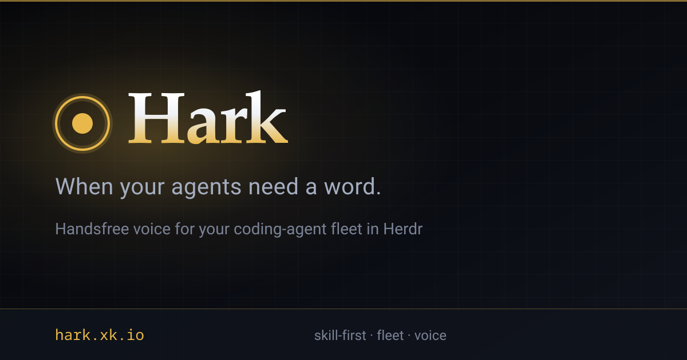

# Hark



> **When your agents need a word.**

**Hark, the herald agents sing:  
“Input, please, O human king!”  
Blocked in Herdr, questions rise;  
Hark relays your voice replies.**

**Supervise the whole herd by voice.** When agents in [Herdr](https://herdr.dev/) (≥ 0.7.1) block, swarm, or wait on you, Hark speaks the ask and takes your answer out loud—so the fleet keeps moving while you’re away from the keyboard.

Run the **`hark`** (or **`handsfree`**) skill in a capable coding agent; it arms watch, speech, and safe delivery. You stay on voice.

```text
Agent becomes blocked
        ↓
Hark / orchestrator speaks the question
        ↓
You answer by voice
        ↓
Cloud STT → validate / confirm if needed
        ↓
Deliver to the correct Herdr target (stale-safe)
        ↓
Work continues
```

| | |
|--|--|
| **CLI** | `hark` |
| **Skill** | `hark` (alias: **`handsfree`**) |
| **Supports** | Claude Code · Grok Build · Antigravity · Pi · OpenCode · Codex |
| **Monitor feed** | `hark monitor` (compact by default) |
| **Herdr** | ≥ 0.7.1 · multi-session (local + SSH) |
| **Speech** | Cloud only (xAI OAuth, OpenAI, Google, MiniMax TTS, …) |
| **Optional daemon** | `harkd` — experimental, not required for v1 |
| **Status** | Python prototype (`uv run hark`) · skill-first handsfree loop |

The verse is playful; **routing and confirmation are not.** Site: **[hark.xk.io](https://hark.xk.io)**.

## Docs

| Doc | Purpose |
|-----|---------|
| [docs/PRIOR_ART.md](docs/PRIOR_ART.md) | Merge log from earlier agent specs |
| [docs/NAMING.md](docs/NAMING.md) | Locked names (`hark`, `harkd`, paths) |
| [docs/PRODUCT.md](docs/PRODUCT.md) | Goals |
| [docs/ARCHITECTURE.md](docs/ARCHITECTURE.md) | Topology, Mode A, library vs daemon |
| [docs/HARKD.md](docs/HARKD.md) | **Experimental `harkd`** — Mode A boundary (not required for v1) |
| [docs/AGY.md](docs/AGY.md) | **Experimental Antigravity** Mode A via agentapi |
| [docs/SPEC.md](docs/SPEC.md) | Normative software spec |
| [docs/PROTOCOL.md](docs/PROTOCOL.md) | HEP event protocol |
| [docs/SAFETY.md](docs/SAFETY.md) | Routing, risk R0–R3, distrust |
| [docs/AUDIO_DESIGN.md](docs/AUDIO_DESIGN.md) | Gate, endpointing, half-duplex |
| [docs/ENDPOINTING.md](docs/ENDPOINTING.md) | Turn detection eval + Smart Turn seam |
| [docs/HERDR.md](docs/HERDR.md) | Herdr / multi-session |
| [docs/PROVIDERS.md](docs/PROVIDERS.md) | STT/TTS providers |
| [docs/IMPLEMENTATION.md](docs/IMPLEMENTATION.md) | Build plan |
| [docs/ACCEPTANCE.md](docs/ACCEPTANCE.md) | Acceptance criteria |
| [schemas/event-v1.schema.json](schemas/event-v1.schema.json) | Event JSON Schema |
| [skill/hark/SKILL.md](skill/hark/SKILL.md) | Primary agent skill |
| [skill/handsfree/SKILL.md](skill/handsfree/SKILL.md) | Alias skill (same loop) |
| [prototype/herdr_event_monitor.py](prototype/herdr_event_monitor.py) | Socket subscribe probe |

## Design goals

- Fast, low-overhead, always-on friendly  
- Event-driven Herdr integration (socket subscribe; poll fallback)  
- Reliable multi-agent / multi-session targeting with **fingerprint + revision** checks  
- Pluggable cloud STT/TTS (no local speech model)  
- Confirm ordinary answers only when unsure; **always** confirm permissions/destructive  
- Recoverable across disconnects (no silent double-send)  

## Install

### One-liner (CLI + skills)

Hosted at **[hark.xk.io/install.sh](https://hark.xk.io/install.sh)** (published with each version tag via GitHub Pages).

```bash
curl -fsSL https://hark.xk.io/install.sh | bash
```

Safer (inspect, then run):

```bash
curl -fsSL https://hark.xk.io/install.sh -o /tmp/hark-install.sh
less /tmp/hark-install.sh
bash /tmp/hark-install.sh
```

The installer is **idempotent** and HTTPS-only. It:

- Clones or updates the repo under `~/.local/share/hark/src` (override with `HARK_HOME` / `--dir`)
- Installs the `hark` CLI via **uv** (`uv tool install`) or **pip** (`--method pip`)
- Copies agent skills to `~/.claude/skills/{hark,handsfree}` (override with `HARK_SKILLS_DIR`)
- Supports `PREFIX` / `DESTDIR`, `HARK_REF` (branch/tag/commit), `--with-wake`, `--no-skills`, `--no-cli`

Then:

```bash
hark doctor
# In Claude Code / Grok Build / Antigravity / Pi / OpenCode / Codex:
#   /hark
```

From a local checkout: `./install.sh` (uses that tree; no re-clone).

### Skills only (`npx skills`)

```bash
npx skills add ultradyn/hark -g -y
# pick agents: -a claude-code -a opencode
```

You still need the **Python `hark` CLI** on `PATH` for the handsfree loop.

**Monitor-capable harness required.** Arm a long-lived wake on:

```bash
hark monitor
```

(Compact HEP lines are the default; use `--full` only when you need uncompacted events.) Claude Code and Grok Build provide a native Monitor; on other harnesses:

- **Pi** — [pi-monitor](https://github.com/clankercode/pi-monitor) (`pi install npm:pi-monitor`): `Monitor` tool that runs a background command and delivers regex-matching stdout into the session
- **OpenCode** — [opencode-monitor-bg](https://github.com/clankercode/opencode-monitor-bg): `monitor_start` / `monitor_list` / `monitor_fetch` / `monitor_kill` — background output delivered back into the owning session
- **Antigravity** — experimental **agentapi** inject (no native Monitor): `hark agentapi register` then `hark agentapi deliver --follow-monitor` (or `./scripts/hark-agy-deliver.sh`). See [docs/AGY.md](docs/AGY.md).

### npm package (`@ultradyn/hark`)

```bash
npm i -g @ultradyn/hark
hark-skill path    # absolute skill dirs
hark-skill list
```

See [`packages/ultradyn-hark/README.md`](packages/ultradyn-hark/README.md). Maintainers: [`RELEASE.md`](RELEASE.md).

## Dev / try it

```bash
cd /path/to/hark   # or your clone
uv sync
uv run hark doctor
uv run hark config init          # optional ~/.config/hark/config.toml
uv run hark status
uv run hark monitor              # primary Mode A feed (compact default)
uv run hark tts "hello"
uv run hark listen               # speak, then silence ends (or end_mode=radio)
uv run hark ask "What color?"
# ambient wake (needs vosk model if engine=vosk):
# uv run hark ambient
uv run hark watch-logs           # live colorful system.jsonl (Ctrl-C to stop)
uv run hark watch-logs --all     # also ambient.jsonl + watch.jsonl
uv run hark logs -f              # raw JSONL follow (no color)
```

Dev tip: run from **latest checkout** (`uv run hark`). After `./install.sh`, the global `hark` on `PATH` is fine for day-to-day use.

### Experimental `harkd` (not required for Mode A)

Mode A v1 does **not** need a daemon. The optional `harkd` scaffold is for process ownership experiments only — see **[docs/HARKD.md](docs/HARKD.md)**.

```bash
uv run hark daemon status
uv run hark daemon start    # foreground; refuses if Mode A workers are live
uv run hark daemon stop
# or: uv run harkd status|start|stop
```

Do not run `harkd` alongside `./scripts/run-mode-a.sh` (single always-on owner; no silent double-send).

### Ambient wake (`hey hark`)

```bash
./scripts/setup-ambient.sh          # uv sync --extra wake + download vosk model + enable config
# download only:
./scripts/download-vosk-model.sh    # methods: hf → curl → wget → browser
./scripts/download-vosk-model.sh --method curl
uv run hark ambient                 # say “hey hark”, then speak a prompt
```

Model lands at `~/.local/share/hark/models/vosk-model-small-en-us-0.15`.

### Config highlights (`~/.config/hark/config.toml`)

- `[listen] end_mode = "radio"` — long pauses OK until `okay hark send` / `end prompt`
- Cancel defaults are product-scoped: `hark cancel` (not “cancel that”)
- `[ambient]` — local 2–3s wake for `hey hark` / `hey herald` (no cloud until activated)
- `[audio] mute_mic_during_tts` — Wave mute ring while TTS plays

## Fixtures (Python ↔ Rust parity)

Shared golden corpora under [`fixtures/`](fixtures/README.md) for wake matching, radio end phrases, HEP event ingest, and live Wave wake snips.

```bash
uv run pytest tests/test_fixtures_parity.py -q
./scripts/export-fixtures.sh              # refresh HEP/syslog samples from live state
./scripts/export-fixtures.sh --with-wake  # also copy today's debug wake snips
```

## Repo

```text
  install.sh              # one-line installer (CLI + skills)
  RELEASE.md              # npm tag → OIDC trusted publish + GitHub Release
  site/                   # marketing site (hark.xk.io) + og.png
  fixtures/               # parity goldens + live wake audio
  schemas/                # HEP JSON Schema
  skill/                  # canonical agent skills (hark, handsfree)
  skills/                 # symlinks → skill/* for `npx skills` discovery
  packages/ultradyn-hark/ # @ultradyn/hark on npm
  src/hark/               # Python Mode A bridge
  tests/
```
